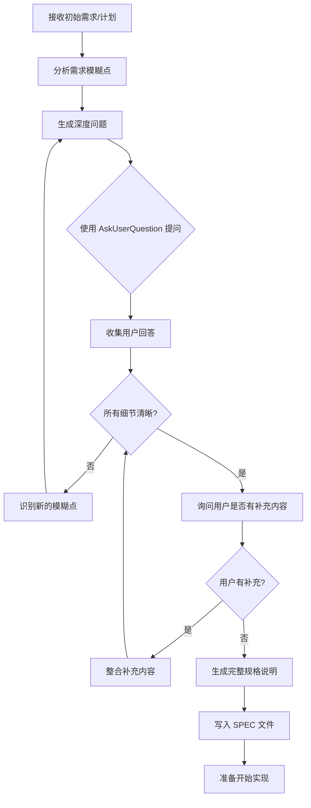

# Interview Skill - 需求深度盘问

## 核心理念

> **"传统模式"**: 用户给模糊指令 -> AI 猜着写 -> 用户改错
> **"Interview 模式"**: 用户给模糊指令 -> AI 追问细节直到明确 -> AI 一次性写出符合意图的代码

这个 skill 改变了 AI 辅助编程的常见模式，通过**前置决策**来避免返工。

## 功能说明

Interview skill 扮演一个严谨的技术面试官角色，在你开始编码之前，通过系统性的深度提问，将模糊的想法转化为可执行的详细技术文档。

### 工作流程



## 盘问维度

Interview skill 会从以下维度进行深度提问：

### 1. 技术实现细节 (Technical)
- 具体的技术栈选择与原因
- 数据结构和类型定义
- API 接口设计
- 状态管理方案
- 性能要求和约束

### 2. UI/UX 设计 (UX)
- 用户交互流程
- 界面布局和组件结构
- 响应式设计要求
- 可访问性 (a11y) 考虑
- 加载状态和错误状态处理

### 3. 潜在顾虑 (Concerns)
- 安全性考虑
- 向后兼容性
- 可维护性
- 测试策略
- 部署和运维

### 4. 权衡取舍 (Tradeoffs)
- 性能 vs 可读性
- 灵活性 vs 简单性
- 一致性 vs 特殊处理
- 短期效率 vs 长期可扩展

### 5. 边界情况 (Edge Cases)
- 空值/空列表处理
- 并发和竞态条件
- 网络失败和重试
- 用户取消操作
- 异常数据输入

## 使用方式

### 基础用法

直接触发 interview，开始交互式盘问：

```
/interview
```

### 带计划文件

```yaml
plan_file: "./docs/feature-plan.md"
output_file: "./docs/SPEC.md"
```

### 指定深度和焦点

```yaml
depth: "exhaustive"
focus_areas: ["technical", "security", "edge_cases"]
```

## 深度级别说明

| 级别 | 说明 | 适用场景 |
|------|------|----------|
| `quick` | 3-5 个核心问题 | 小型功能、快速原型 |
| `thorough` | 8-15 个深度问题 | 常规功能开发 |
| `exhaustive` | 20+ 个全面问题 | 核心模块、架构决策 |

## 提问原则

> [!IMPORTANT]
> 问题必须是**不显而易见的**（non-obvious）

Interview skill 遵循以下提问原则：

1. **不问显而易见的问题** - 避免 "你要用什么语言?" 这类可以从上下文推断的问题
2. **追问隐藏假设** - 挖掘用户潜意识中的假设，使其显式化
3. **探索边界场景** - 思考 "如果...会怎样?"
4. **权衡决策点** - 在有多种选择时，明确优先级和取舍

## 用户补充环节

> [!NOTE]
> 在所有预设问题完成后，**必须**给用户一个自由补充的机会

在系统化提问结束后、生成 SPEC 文件之前，需要主动询问用户：

```
"以上问题已经覆盖了主要方面。在我生成规格说明之前，您还有什么想要补充的内容吗？
比如：
- 特殊的业务规则或约束
- 团队内部的约定或偏好
- 我没有问到但您认为重要的点
- 任何其他想法或顾虑

请随意补充，或输入"无"继续生成规格说明。"
```

这个环节的目的是：
1. **防止遗漏** - 再专业的盘问也可能漏掉用户心中的隐性需求
2. **赋予掌控感** - 让用户感到他们对最终产物有充分的输入权
3. **捕捉隐性知识** - 用户可能有些"理所当然"的假设没有被问到

如果用户有补充内容，需要将其整合后重新评估是否有新的模糊点需要追问。

## 提问方式

> [!IMPORTANT]
> **优先使用多选 (multiSelect: true)**

使用 `AskUserQuestion` 工具时的原则：

1. **默认使用多选** - 除非选项之间是严格互斥的，否则都应设置 `multiSelect: true`
2. **多选的适用场景**：
   - 关注领域、功能模块选择
   - 需要考虑的边界情况
   - 希望支持的特性列表
   - 测试覆盖范围
   - 任何"需要哪些"、"考虑哪些"类型的问题
3. **单选仅用于**：
   - 明确的二元决策（是/否、启用/禁用）
   - 技术方案 A vs B 的互斥抉择
   - 优先级排序（选出最重要的一个）
4. **用户友好** - 多选不妨碍用户只选一个，但给予了更大的灵活性

## 输出格式

完成盘问后，会生成结构化的 SPEC 文件：

```markdown
# 功能规格说明书

## 概述
[简要描述功能目标]

## 技术决策
- 决策1: [选择] - [原因]
- 决策2: [选择] - [原因]

## 详细需求
### 功能需求
- FR-1: [需求描述]
- FR-2: [需求描述]

### 非功能需求
- NFR-1: [需求描述]

## 接口定义
[API/组件接口]

## 边界情况处理
- Case-1: [场景] -> [处理方式]

## 测试要点
- [关键测试场景]

## 待确认项
- [如有任何遗留问题]
```

## 实际示例

### 输入

用户需求："给应用加个深色模式"

### Interview 过程

```
Q1: 深色模式的切换触发点在哪里？是独立的设置页，还是顶部导航栏的快捷开关？

Q2: 是否需要跟随系统主题自动切换？如果用户手动选择后，系统主题变化时如何处理？

Q3: 现有组件库是否支持主题切换？如果不支持，是迁移到支持的库还是自己实现主题层？

Q4: 颜色方案是设计师提供，还是需要我根据浅色主题推导？有品牌色约束吗？

Q5: 切换主题时需要过渡动画吗？如果有，性能预算是多少？

Q6: 主题偏好存储在哪里？LocalStorage、用户账号还是两者同步？

Q7: 图片和 SVG 图标如何处理？是提供两套资源还是用 CSS filter？
...
```

### 输出

生成完整的 `SPEC.md`，包含所有确认的细节和实现指南。

## 注意事项

> [!WARNING]
> - 此 skill 侧重于**需求澄清**，不直接生成代码
> - 对于已经足够明确的需求，可使用 `quick` 深度快速确认
> - 生成的 SPEC 文件应在开始编码前进行最终审阅

## 相关技能

- [file_skill](./file_skill.md) - 用于读取计划文件和写入规格文件
- [search_skill](./search_skill.md) - 用于分析现有代码结构

## 灵感来源

基于 Claude Code 工作流优化理念。核心思想是通过 "前置决策" 改变 AI 辅助编程模式，让 AI 在动手之前先把需求搞清楚。
